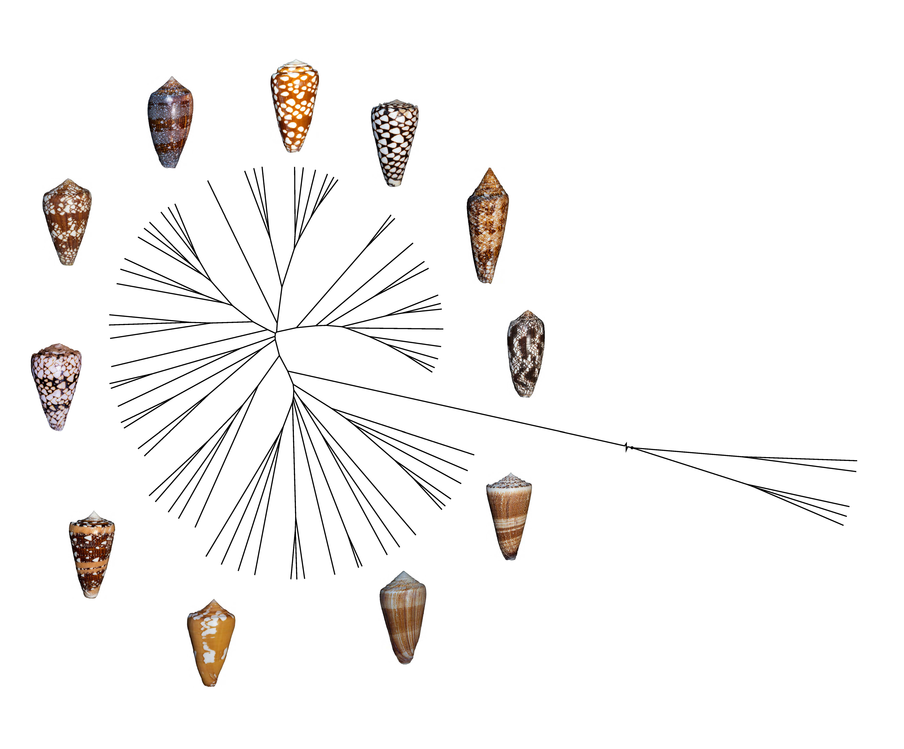

### Diversification & Prey Specificity

My research on cone snails (family [Conidae](https://en.wikipedia.org/wiki/Conidae)) explores the evolutionary dynamics that shape the diversity of these fascinating marine predators. Cone snails are renowned for their highly specialized venom apparatus, which they use to capture prey. While many species target fish or worms, a subset of these snails has evolved to prey on other gastropods, providing an interesting case study of co-evolutionary arms races and toxin diversification. This research has been done in collaboration with the group of [Prof. Baldomero M. Olivera](https://faculty.utah.edu/u0034901-BALDOMERO_M_OLIVERA/hm/index.hml), where have been investigating the evolutionary pathways that drive toxin variation in cone snails that specialize in hunting other mollusks. We have a paper recently accepted in *Molecular Biology and Evolution* that delves into the molecular mechanisms underpinning this evolution, revealing unique adaptations in venom composition tied to prey specificity and ecological niche occupation.

For further reading, explore the general biology and pharmacological significance of cone snails in [ScienceDirect](https://www.sciencedirect.com/topics/pharmacology-toxicology-and-pharmaceutical-science/conidae) or a detailed review in *The Handbook of Toxinology* [here](https://www.sciencedirect.com/science/article/pii/B9780123850959000610).

### Nanopore DNA Barcoding in Hyperdiverse Clades

In addition to our work on Conidae evolution, also along with the Olivera Group, I am leading a project using a mix of traditional collection methods, namely _lumun lumun_ [you can read more here](https://conchology.be/?t=68&u=211020&g=e397ac5edafddc3972ea01603ac848bc&q=6d51faab6f02c5fe262e0dfd9f128179) with real-time nanopore sequencing for DNA barcoding, focusing on hyperdiverse clades of micromollusks (which involves Conidae and several other families). This work is carried with my guidance by my students at the Science Research Initiative (SRI), where we aim to uncover cryptic diversity within these underexplored taxa and tap into [their pharmaceutical potential](https://pmc.ncbi.nlm.nih.gov/articles/PMC2975739/). By combining high-throughput sequencing with traditional taxonomy and peptide discovery, we aim to refine our understanding of species boundaries and evolutionary relationships within these groups, contributing to a more accurate and comprehensive catalog of molluskan evolution and biodiversity.

### Stay tuned for incoming news on these projects!

  
*Figure 1. Phylogenetic tree of some cone snails showing the rapid diversification of these beautiful (and sometimes deadly!) mollusks.

---
