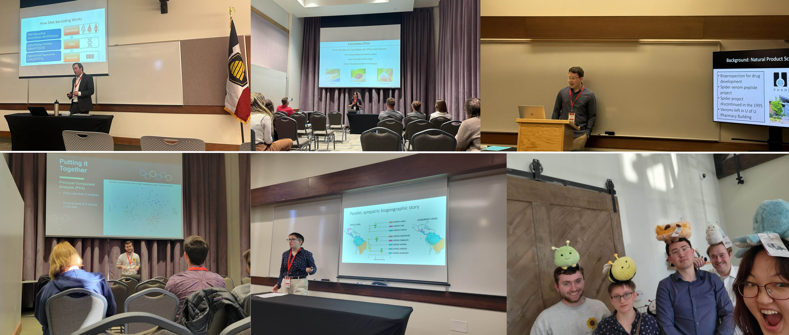
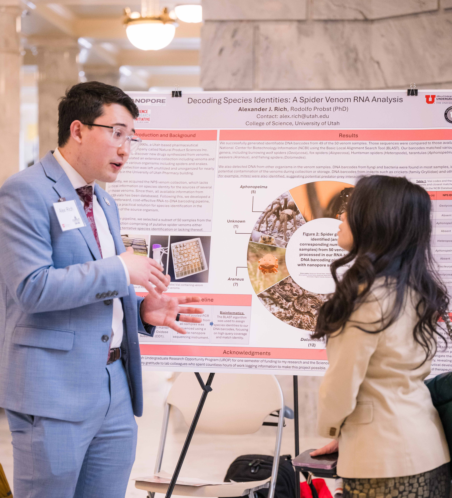
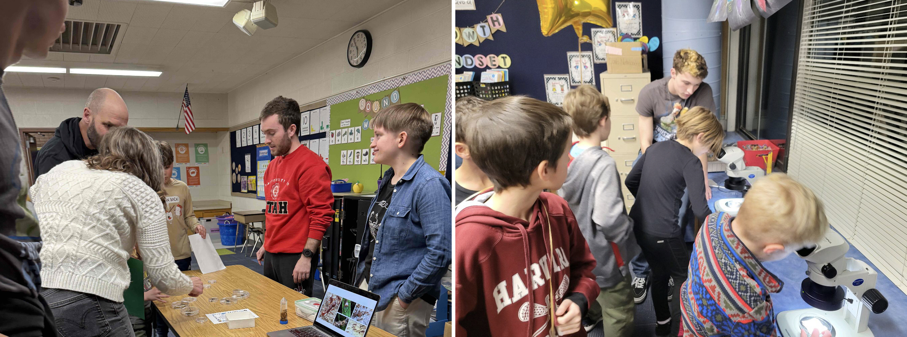

## Lab News

### June 2025
#### _Megan's paper is out!! Beautiful combination of genomics and morphological work! Huge congrats of her 1st author publication on ISD!_
Nice contribution lead by Megan on generic boundaries for army ants - considered solid and stable for nearly 100 years! Big changes! Check it out [here](https://academic.oup.com/isd/article/9/3/6/8155810)! 

---
### May 2025
#### _Rocky was selected to preset at the Association of Field Ornithologists’ Annual Meeting in Ogden, Utah, this July!_
Rocky will be presenting a poster on species boundaries on stonechats! Wait, there is more: he was granted a student travel award to cover his participation! Superb!

#### _Ainsley presented a comprehensive poster on her research using nanopore sequencing for bird taxonomy at the Wilkes Summmit!_
More than 400 barcodes and a beautiful poster! Well done, Ainsley! Now moving into the manuscript phase!

#### _Megan was granted the University of Utah School of Biological Sciences' Undergraduate Research Award!_
Megan was granted a full semester of funding to support her research on army ant evolution! Hooray!  

---
### April 2025
#### _Kyle presented his research on nanopore sequencing for micromollusk identification at the NCUR!_
Kyle attended the National Conference of Undergraduate in Pittsburgh and gave a great oral talk! Way to go!

#### _Will just won the prestigious BSA Undergraduate Student Research Award!_
Will was selected among a pool of highly qualified folks for the Botanical Society of America SRA! Funding to support his molecular work on a species-complex within Western US [gooseberries](https://en.wikipedia.org/wiki/Ribes)! Hooray!

---
### March 2025
#### _Megan and Sylvia did great on their oral talks at the 2025 Pacific Branch of the Entomological Society of American meeting in Salt Lake City!_
Megan presented on her current work on the biogeography of army ants and Sylvia on uncovering mealybug identities with Nanopore sequencing! Well done!! Update: Megan WON BEST UNDERGRADUATE ORAL PRESENTATION for her talk on [_Labidus_](https://www.alexanderwild.com/Ants/Taxonomic-List-of-Ant-Genera/Labidus) biogeography! Let's gooo!

Left to right: Megan and her _Labidus_, Sylvia and her Coccoidea!

---
### February 2025
#### _Our lab had a strong presence at the 2025 Utah Conference of Undergraduate Research!_
Five oral talks, what?! Kyle, Megan, Alex, Sylvia, and Will all traveled to SUU in Cedar City to present their research at the [2025 UCUR](https://www.suu.edu/ucur/program.html)! Some highlights below! Hooray!

From top to bottom, left to right: Kyle, Sylvia, Alex, Will, and Megan at the stage! - and practicing :)

#### _Alex shined at the ROCH event!_
The University of Utah selects a group of amazing students each year to exhibit their work to Utah State legislators at an event called Research on Capitol Hill (ROCH). Alex was selected to present his work on our RNA to DNA barcoding pipeline utilizing spider venoms! Check it out his poster [here](https://our.utah.edu/wp-content/uploads/sites/35/2025/02/Rich-scaled.jpg).

---

### January 2025
#### _Megan is famous!_
Megan was selected to have her profile displayed at Humans of the U! Very nice! Check it out [here](https://science.utah.edu/students/student-research/megan-duval/) - and don't miss on the great pics! 

#### _More presentations from our group!_
Kyle Cink got selected to present his research on nanopore sequencing of SE Asian micromollusks at the National Conference of Undergraduate Research (NCUR) this April in Pittsburgh! Hooray! And Megan DuVal and Sylvia Lee were both selected to present oral talks at the Pacific Branch of the Entomological Society of America this coming March in Salt Lake City! 

#### _STEMFEST!_
Our lab were at full steam during the [STEMFEST at Eastwood Elementary](https://schools.graniteschools.org/eastwood/2025/01/15/stemfest/). What a great time interacting with students and their families while talking bugs, mollusks, birds, and DNA! 

Folks sharing their fav critters with the STEMFEST attendees. Left: Will and Megan talking plants and bugs. Right: Rocky rocking the dissecting scopes and all the macro-wonders!

---

### December 2024
#### _More good news for the 2025 UCUR!_
Congratulations to Alex, Kyle, Megan, and Sylvia, and Will for <ins>ALL</ins> being selected to present oral talks at the Utah Conference of Undergraduate Research (UCUR) this coming February at Southern Utah University! Way to go, peeps!

#### _Congratulations to Will and Ainsley for being granted a renewal for their UROP and Wilkes Scholarships!_
Will received a second semester of UROP award for his project researching species boundaries within the aguacatillo genus _Ocotea_ in Costa Rica. Ainsley, a Wilkes Scholar, is investigating cryptic bird diversity on the *Emberiza* genus.

---

### November 2024
Megan DuVal just won **first place** in the Student Competition for President's Prize for her oral talk at the 2024 Annual Meeting of the [Entomological Society of America](https://www.entsoc.org/events/annual-meeting)! And Alex Rich just got selected by the University of Utah Office of Undergraduate Research to present his research on spider venoms this coming February at [Research on Capitol Hill (ROCH)](https://our.utah.edu/education-events/research-on-capitol-hill/)! Awesome news this month of November!

---
### October 2024
#### _Successful presentations at the 2024 SACNAS NDiSTEM Conference!_
Congratulations to Sara, Ainsley, Alex, Kyle, Megan, and Sylvia on presenting their posters at the [SACNAS NDiSTEM](https://www.sacnas.org/conference) conference in Phoenix! What a great opportunity for each of them to share their work with a broader audience, engage in discussions, and gain valuable feedback. I’m proud of their hard work and dedication - exciting to see them represent our research so well!

  
In clockwise order (from top row): Sara England, Megan DuVal, Sylvia Lee, Kyle Cink, Alex Rich, and Ainsley Parkins presenting their research at the SACNAS NDiSTEM. Woot!

---
### September 2024
#### _Awards galore to attend the 2024 SACNAS NDiSTEM Conference!_
Looks like we have a big group attending the [SACNAS NDiSTEM](https://www.sacnas.org/conference) conference in Phoenix this October! Our group was extremely successful in being granted Travel Awards for the conference. Alex, Sara, Rocky, and Will were granted a highly sought University of Utah SACNAS Chapter Travel Award. Carter, Megan, Sylvia, Ainsley were granted the competitive SACNAS Travel Scholarship! Impressive!   

--- 
### August 2024
#### _Congratulations to our 2024 UROP and Wilkes Scholar Awardees!_

#### Sylvia Lee
*Project*: **Unraveling the Identities of Associated Insects in Ant-Plant Symbioses with Nanopore DNA Sequencing**  
Sylvia was awarded a UROP grant to explore insect diversity within ant-plant symbioses using cutting-edge nanopore sequencing technology. Way to go, Sylvia!

#### Will Pearce
*Project*: **DNA Barcoding to Solve Species Boundaries: Discovering Endemic _Ocotea_ (Lauraceae) in Costa Rica**  
Will received a UROP award for his project researching how DNA barcoding can help us uncover species boundaries within the aguacatillo genus _Ocotea_ in Costa Rica. Great job, Will!

#### Alexander Rich
*Project*: **Decoding Spider Diversity: Venom RNA and Protein Peptide Analysis**  
Alexander was honored with a UROP award for his groundbreaking research analyzing spider venom RNA to uncover spider diversity. Impressive, Alex!

#### Ainsley Parkins (Wilkes Scholar Awardee)
*Project*: **Unveiling Cryptic Avifauna Diversity Using Nanopore DNA Sequencing: A Case Study in the Passerine Genus *Emberiza* (Passeriformes: Emberizidae)**  
Ainsley, a Wilkes Scholar, is investigating cryptic bird diversity using nanopore sequencing, with a focus on the *Emberiza* genus. Congratulations, Ainsley!

#### Megan Duval (Shared Mentorship with Dr. Jack Longino)
*Project*: **Exploring Species Boundaries in *Labidus*, a Widespread Army Ant Genus**  
Megan, with guidance from both Jack Longino and myself, was awarded a renewal for her UROP project investigating species boundaries within the army ant genus _Labidus_. Megan just submitted a paper (what!) product of her research! Hooray! 

