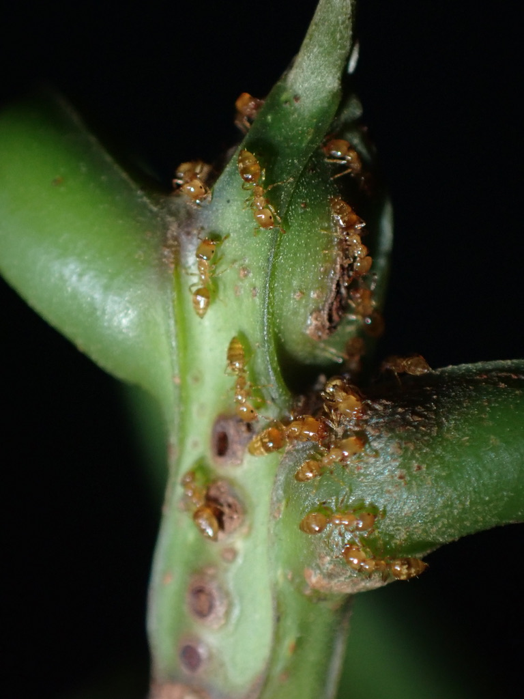

### Research Overview

One of my research interests focuses on the evolutionary ecology and molecular phylogenetics of ants, with a particular emphasis on ant-plant symbioses. Ants are key ecosystem players, and understanding their evolutionary and ecological roles sheds light on major topics of biology and evolution. My work has explored ant-plant relationships through a combination of **natural history**, **systematics**, and **cutting-edge molecular tools**.

I am studying ant-plant symbioses using the [***Myrmelachista***](https://www.antweb.org/images.do?genus=Myrmelachista) system as a model. This group of Neotropical ants is involved in complex mutualisms with understory plants (mainly nesting inside species in the avocado family). My recent study, published in *Proceedings of the Royal Society B*, [revealed an extreme level of convergent evolution within those ant-plant mutualisms](https://royalsocietypublishing.org/doi/10.1098/rspb.2024.1214). You can read about it [here](https://attheu.utah.edu/research/of-ants-and-trees-evolutionary-deja-in-the-tropical-rainforest/) and [here](https://www.eurekalert.org/news-releases/1051895)I am currently expanding this project and including **whole-genome sequencing** to uncover the genomic foundations/signatures underlying convergent/parallel evolution in this group. I am also starting to explore how _Myrmelachista_ ant species adapt to environmental pressures, using **functional trait analyses** and long-term monitoring of their plant hosts.

### Stay tuned for incoming news on these projects!

  
Busy, busy _Myrmelachista_ workers cleaning the surfaces of their understory plant host. Tidy little cuties!

---

